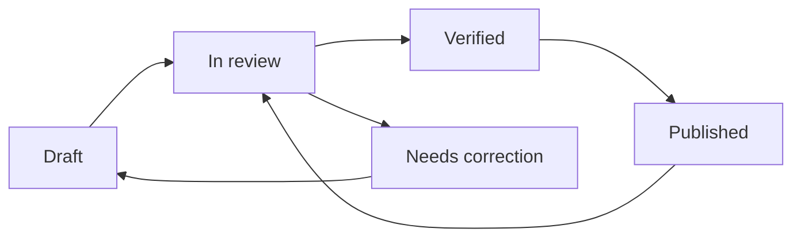
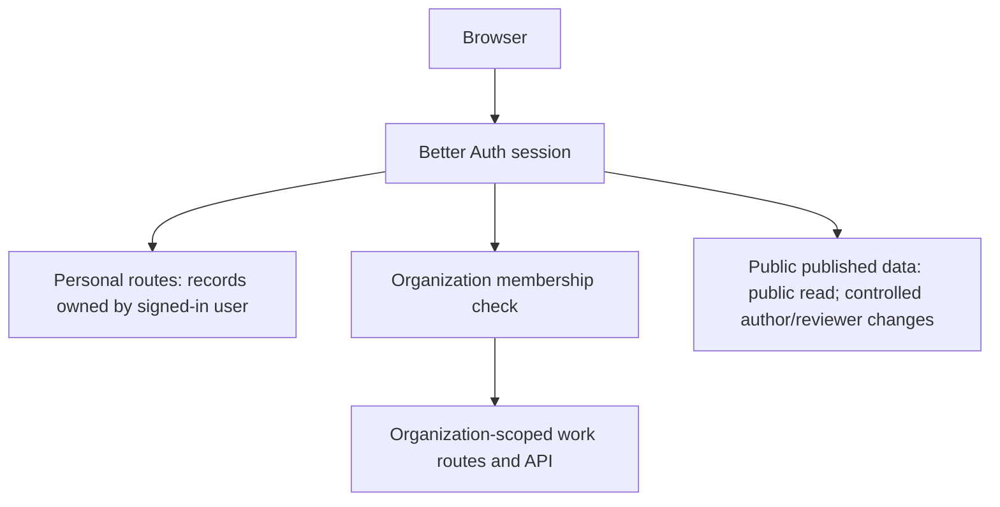

# Tracking Media

**Build a tracker for what matters. Keep private work private. Publish public data with its evidence attached.**

Tracking Media is a tracking and data-publishing platform for individuals, teams, and the public. A user can keep personal records, collaborate in a separately authorized organization workspace, and follow public trackers. Those experiences share one account and a consistent product, while their data and access rules remain distinct.

This repository contains the first working web-app foundation and an evolving prototype. This README records the product idea, boundaries, technical direction, what exists now, and the planned path from prototype to a dependable product. Planned features are labelled as such; they are not represented as already implemented.

## Contents

- [Product vision](#product-vision)
- [Three product spaces](#three-product-spaces)
- [Roles and publishing workflow](#roles-and-publishing-workflow)
- [Public-interest data model](#public-interest-data-model)
- [Business model](#business-model)
- [Current prototype](#current-prototype)
- [Architecture](#architecture)
- [Run locally](#run-locally)
- [Environment configuration](#environment-configuration)
- [Build roadmap](#build-roadmap)
- [Security, privacy, and quality principles](#security-privacy-and-quality-principles)
- [Repository guide](#repository-guide)

## Product vision

The product is a home for **living trackers**: structured records with owners, maintainers, history, access rules, and useful views. Rather than forcing every task into one predefined workflow, users create or use trackers that fit the thing being measured.

Examples include:

- A person tracking study sessions, habits, fitness, spending, reading, or a personal project.
- A team tracking milestones, deliverables, risks, service indicators, or operational updates.
- A public-interest group tracking government programme budgets and results with source documents and a documented method.
- A community tracking public sports or entertainment statistics from cited sources.

The product should make it easy to move from **record → history → trend → explanation**. It should clearly show who maintains a tracker, when it changed, who can see it, and where published data came from.

### Product principles

1. **Distinct spaces, clear boundaries.** Personal information, organization work, and public datasets have separate ownership, navigation, and authorization.
2. **Evidence before interpretation.** Public facts link to sources and methods. The product does not turn data into a claim that an official or party is “good” or “bad.”
3. **Missing is not zero.** Unknown, delayed, unreleased, and unreported values remain explicit.
4. **People are accountable for changes.** Trackers have owners; shared and public data can have maintainers and reviewers; important changes retain provenance.
5. **Useful at every scale.** A personal tracker should be quick to start; an organization workspace should support real roles; public trackers should be understandable and auditable.

## Three product spaces

### 1. Personal Trackers

The personal dashboard is the signed-in user’s private home. A user creates trackers for information they choose to maintain, adds entries over time, and sees personal progress alongside public trackers they own or follow.

**Examples:** goals, habits, learning plans, applications, trips, home inventory, personal projects, and household budgets.

**Planned tracker capabilities:** flexible fields and entry types, reusable templates, charts and summaries, reminders, imports/exports, and private sharing controls. The present implementation provides basic personal tracker creation and a user-owned data model; advanced field builders, analytics, alerts, and sharing are later work.

Personal data is not copied into an organization workspace. Public trackers shown on the personal dashboard are public records the user owns or follows; they remain public tracker records, not private personal records.

### 2. Work / Organization Trackers

Work mode is a separate, organization-scoped environment for team records. It is not a personal dashboard with a company label. A user can reach a workspace only after signing in and passing a server-side membership check for that organization.

**Examples:** project progress, milestones, team tasks or indicators, operational metrics, risks, and recurring status updates.

Workspaces are designed for organization identity and access management, including single sign-on (SSO) through a company identity provider. Organization membership and role determine what the user may see or change. Provider login alone does not grant access to a workspace.

**Work roles in the current foundation:**

| Role | Intended access |
| --- | --- |
| Owner | Manage workspace, membership, invitations, and settings; create and update work trackers. |
| Admin | Help manage workspace access and settings; create and update work trackers. |
| Member | Create and update permitted work trackers and entries. |
| Viewer | Read trackers shared with the workspace. |

Work trackers can be shared with the workspace or limited to the owner and workspace admins. Every server request checks the signed-in identity, workspace membership, role, and tracker visibility. Organization records are not queried by the personal dashboard.

### 3. Public Trackers

Public Trackers are living, source-backed datasets that a maintainer can publish for anyone to inspect. They may cover government programmes, public budgets, sports, entertainment, or other information that is appropriate to publish and can be supported by evidence.

Public-interest reporting should help people understand what records show, what they do not show, and how figures were derived. It must not use the data as a political persuasion tool or present a tracker as proof of a broad value judgment.

**Planned public tracker capabilities:** source documents, record-level provenance, release notes, update timestamps, reviewer assignments, revision history, methodology versions, charts, missing-data indicators, and public subscriptions. The database already has foundational public tracker and entry models, but public create/review/publish screens and APIs are not yet complete.

## Roles and publishing workflow

### Public tracker roles

The intended public-data roles are:

- **Owner:** accountable for the tracker’s purpose, scope, and ongoing maintenance.
- **Maintainer:** collects sources, enters or imports records, and proposes corrections.
- **Reviewer:** checks cited evidence, calculations, period/geography alignment, and methodology before verification or publication.
- **Public reader:** reads published records, methods, sources, and revision history without edit access.

One person may hold more than one role in an early prototype, but sensitive public-interest records should have a review step separate from data entry wherever practical. The current schema contains tracker owners and entry status/reviewer fields; a complete public collaborator and review-history model is planned.

### Draft → Review → Verified → Published



- **Draft:** the owner or maintainer is assembling records and sources. Not visible as a public claim.
- **In review:** a reviewer checks the evidence, period, geography, units, calculations, and explanation.
- **Verified:** the reviewed record matches the cited evidence and stated method at the time of review. This is not a guarantee that an underlying source is complete or will never change.
- **Published:** the approved version is visible publicly with its sources, method, review status, and update time.
- **Needs correction:** a reviewer or maintainer has identified a problem. The issue and subsequent correction should be traceable.

Corrections to published records should create a visible revision, retain the prior value and reason for change, and trigger another review when the change affects a reported conclusion.

## Public-interest data model

### Financial and service-delivery measures

A government programme tracker should separate measures that are often conflated. It should show the programme, jurisdiction, financial year or reporting period, price/accounting basis when available, unit, source, and reporting timestamp for each measure.

| Measure | Meaning and display rule |
| --- | --- |
| Allocation | Budgeted or approved amount for a specified programme, jurisdiction, and period. Label whether it is an original budget, revised estimate, or another published figure. |
| Funds released | Funds recorded as released or transferred by the reporting authority. A release is not automatically expenditure by the final implementing body. |
| Expenditure | Spending reported by the named agency and source for the stated period. Preserve the source’s accounting basis; do not silently mix commitments, transfers, and audited expenditure. |
| Beneficiaries | People or households reported as served/reached, with the source’s definition and reporting period. State whether the count is unique, cumulative, enrolled, eligible, or served. |
| Outcomes | Observed service or population measures relevant to the programme, including their source, denominator, period, and limitations. Do not imply causation from a simple before/after comparison. |
| Data completeness | Which expected fields or periods are present, missing, delayed, disputed, or not published. Show unavailable values as unavailable, never as zero. |

### Derived measures

Derived figures are only useful when numerator and denominator have compatible periods, jurisdictions, programme definitions, and accounting bases. Every calculated measure must expose its formula, input records, units, and caveats.

- **Utilization of released funds:** reported expenditure ÷ reported releases, only when both refer to compatible periods and the same accounting scope. Label it as a reported ratio, not a measure of programme success.
- **Spend per beneficiary:** reported expenditure ÷ beneficiaries for the same programme, geography, and period. Disclose whether beneficiaries are unique people, households, enrolments, or service visits.
- **Spend per household:** reported expenditure ÷ households reached, only when the household count is actually reported and aligned to the period.
- **Per-capita measure:** a clearly defined public expenditure ÷ the relevant population covered. Show the population source and coverage definition; do not imply each resident received that amount.
- **Allocation-to-expenditure comparison:** display the source values separately and calculate a difference only when their fiscal periods and accounting definitions align. A difference is not automatically “money missing” or “money returned to taxpayers.”

When a denominator is unknown, overlapping periods cannot be reconciled, or a source does not support a calculation, the UI should explain that the figure is unavailable rather than estimate it silently.

### Sources, timestamps, and uncertainty

Each public record is intended to include:

- Source title, publisher/agency, direct URL, publication date, and the date/time Tracking Media retrieved or checked it.
- Relevant document page/table/section where practical; retained document copy or checksum where licensing and storage rules allow.
- The record’s geographic scope, time period, unit, and the original label used by the source.
- Methodology version, transformation/calculation notes, and any assumptions.
- Maintainer, reviewer, review time, review note, and status; later corrections remain in revision history.
- Explicit quality notes: provisional, revised, incomplete, conflicting sources, missing denominator, or source not independently audited.

Prefer primary records (budget documents, official releases, administrative reports, and audited statements) for the facts they directly report. Independent audits, research, and reputable secondary sources can provide context or cross-checks and must be labelled as such. Cite the exact source used for each value rather than implying that one source supports unrelated fields.

### Evidence and interpretation policy

- Report what the evidence supports; separate fact, calculation, and interpretation.
- Present uncertainty, revisions, source disagreements, and missing records plainly.
- Do not infer fraud, intent, effectiveness, or political responsibility from a spending gap alone.
- Compare outcomes across time or places only with context on population, inflation, programme design, data definitions, and other relevant differences.
- Let readers inspect sources and methodology without requiring a paid account.

## Business model

Potential revenue streams are exploratory and should not undermine data trust or access to public evidence.

1. **Personal:** a useful free tier; optional paid plans for additional capacity, automation, integrations, exports, and advanced analytics.
2. **Teams:** organization subscriptions based on seats or workspace capabilities, with roles, audit history, SSO, and administration features.
3. **Public tracker creators:** optional paid research/maintenance tools, subscriptions, or clearly disclosed creator revenue share for useful trackers.
4. **Data/API services:** paid access to supported APIs, bulk exports, or organization-grade integrations where rights and source licences permit.

Published public-interest facts, source links, review notes, and methodologies should remain accessible. Payment must not buy a “verified” label, alter review decisions, suppress corrections, or influence editorial independence. Sponsorships and commercial relationships must be disclosed.

## Current prototype

The repository is an early application foundation. The current scope is intentionally narrower than the full product vision.

| Area | Implemented now | Planned next |
| --- | --- | --- |
| Identity | Email/password sign-up and sign-in, email verification, password reset, sessions. | Production email operations, rate-limit/abuse monitoring, account recovery hardening. |
| Personal | Authenticated dashboard, personal tracker creation, user-owned tracker records. | Flexible custom fields, entry editing/history, charts, templates, reminders, export/import. |
| Work | Organization creation, membership roles, invitations, workspace-only trackers and entries, visibility settings, audit events, organization-scoped OIDC setup. | More administrative controls, fuller SAML onboarding, policy settings, integrations, richer audit search. |
| Public | Separate public tracker/entry/follow schema and review-state vocabulary; owned/followed public records can appear on the dashboard. | Public tracker directory and detail pages, authoring, source attachments, reviewer workflow, revision history, publication APIs, calculations and charts. |
| UX | Responsive dark visual system, sign-in and reset screens, distinct organization workspace surface, keyboard focus styles and reduced-motion support. | Broader keyboard/screen-reader review and design refinement across tracker creation and public reading. |
| Operations | PostgreSQL Docker Compose configuration, Prisma migrations, environment template. | Hosted deployment, observability, backups/restore procedure, CI/CD, security review, and production support. |

The public database models are a foundation, not a completed public-data product. A status field alone is not a review workflow; the reviewer controls, change log, evidence UI, and publication gates still need to be built.

## Architecture

### Stack

- **Next.js 16 App Router, React 19, TypeScript** — pages, server-rendered views, and API route handlers.
- **PostgreSQL 17** — relational application data; Docker Compose for local development.
- **Prisma 7** — schema, migration history, and generated client.
- **Better Auth 1.7** — email/password identity, sessions, organization support, email verification, and reset flow; SSO plugins provide organization identity-provider integration.
- **Zod** — server-side payload validation.
- **Resend API** — optional transactional email delivery for verification, password reset, and invitations; local development prints preview links to the server terminal if email credentials are not configured.

### Authorization flow



Authentication establishes who signed in. Authorization determines which account, workspace, role, and record the request may access. The server performs the check on every protected page/API request; hiding a button in the browser is not an access control.

### Data model overview

- **Identity/organization:** `User`, `Session`, `Account`, `Verification`, `Organization`, `Member`, `Invitation`, and `SsoProvider`.
- **Personal:** `PersonalTracker` and `PersonalTrackerEntry`, owned by a user.
- **Work:** `WorkTracker`, `WorkTrackerEntry`, and `WorkAuditEvent`, scoped to an organization; entries record their author.
- **Public:** `PublicTracker`, `PublicTrackerEntry`, and `PublicTrackerFollow`, separated from personal and work tables. Public entries include metric, period, value/unit, source URL/title, source publication date, and review status.

Public collaborator assignments, robust source-document storage, methodology versioning, and immutable revision/review history are planned schema work. The public schema should evolve before implementing the full publication UI.

## Run locally

### Requirements

- Node.js 22.18 or newer. Node 24 is the project’s current development runtime.
- npm and Docker Desktop with Docker Compose, or a PostgreSQL 17 database.
- A supported OS and a terminal opened in this app directory.

### Setup

1. Install the locked dependencies:

   ```bash
   npm ci
   ```

2. Create a local environment file:

   ```bash
   cp .env.example .env
   ```

   On Windows PowerShell, use `Copy-Item .env.example .env`.

3. Replace `BETTER_AUTH_SECRET` with a unique random value. One option with Node installed is:

   ```bash
   node -e "console.log(require('crypto').randomBytes(32).toString('base64url'))"
   ```

   Keep `.env` private; it is ignored by Git.

4. Start the local database:

   ```bash
   docker compose up -d database
   ```

5. Generate the Prisma client and apply the checked-in migrations:

   ```bash
   npm run db:generate
   npm run db:migrate
   ```

6. Start the development server and open [http://localhost:3000](http://localhost:3000):

   ```bash
   npm run dev
   ```

For development, `npm run db:migrate` uses Prisma’s development migration workflow. When deploying an existing migration history to a hosted database, use `npx prisma migrate deploy` as part of the deployment process; do not run development migrations against production.

### Useful scripts

| Command | Purpose |
| --- | --- |
| `npm run dev` | Start Next.js development mode. |
| `npm run build` | Create a production build. Stop the dev server before building because both modes use Next.js build output. |
| `npm run start` | Serve a production build. |
| `npm run lint` | Run ESLint. |
| `npm run db:generate` | Generate Prisma Client into the ignored `src/generated/prisma` directory. Run after dependency installation or schema changes. |
| `npm run db:migrate` | Apply/create development migrations. |
| `npm run db:auth-schema` | Regenerate the Better Auth schema when auth plugins/schema change; review generated schema changes before migrating. |

### Environment configuration

| Variable | Required | Purpose |
| --- | --- | --- |
| `DATABASE_URL` | Yes | PostgreSQL connection string. The example matches the included local Docker Compose service. |
| `BETTER_AUTH_SECRET` | Yes | Private secret used to protect auth/session operations. Use a strong unique value. |
| `BETTER_AUTH_URL` | Yes | Server-side application base URL, normally `http://localhost:3000` locally. |
| `NEXT_PUBLIC_APP_URL` | Yes | Public application URL used by browser auth and links. Keep it aligned with `BETTER_AUTH_URL`. |
| `RESEND_API_KEY` | No for local preview; required for delivered email | Resend API credential. |
| `EMAIL_FROM` | No for local preview; required for delivered email | Sender using a domain verified with the email provider. |
| `SSO_TRUSTED_ORIGINS` | No until configuring SSO | Comma-separated identity-provider origins allowed during organization SSO registration. |

With placeholder email variables in development, verification, invitation, and reset URLs are printed to the dev server terminal. Production sends email through Resend and requires valid credentials and a verified sender. Never commit real credentials.

### Common setup and preview issues

- If the generated Prisma client cannot be resolved, install dependencies and run `npm run db:generate` from this directory. The generated client is intentionally not committed.
- Keep package versions pinned by `package-lock.json`; use `npm ci` for a clean reproducible install. Avoid forcing dependency upgrades to work around a missing package version.
- If Next.js displays a stale Turbopack/hydration overlay after changing branches or running a build, stop the dev server, restart `npm run dev`, and hard-refresh the browser. Do not run `npm run build` while the dev server is using the same build directory.
- If the database is unavailable, check `docker compose ps` and `docker compose logs database`, then confirm `DATABASE_URL` points to the running service.

## Build roadmap

The roadmap grows one complete vertical slice at a time so each feature has UI, server authorization, persistence, and a reviewable result.

### Phase 1 — Finish the foundation

- Keep account sign-up, verification, sign-in, reset, and session behavior reliable.
- Add automated coverage for authentication, role boundaries, data validation, and workspace isolation.
- Improve organization administration: role changes, invitation lifecycle, SSO setup guidance, and audit history.
- Add deployment configuration, database backup/restore, structured logs, and error monitoring before inviting real teams.

### Phase 2 — Complete useful Personal Trackers

- Define tracker fields and value types (text, number, date, status, category, and related types).
- Add create/read/update/archive flows for entries and trackers with validation and history.
- Add templates, simple charts, filters, time ranges, and export.
- Provide accessible, responsive tracker forms and empty/loading/error states.

### Phase 3 — Make Work a dependable team product

- Add complete tracker and entry management, comments or review notes where useful, filters, and clear ownership.
- Complete role-aware workspace management and SAML/OIDC administration with provider-specific setup guidance.
- Expand audit records for membership, settings, and tracker changes.
- Add integrations only after permission scopes and data ownership are documented.

### Phase 4 — Build the Public Trackers workflow

1. Create a public tracker directory and detail page with owner/maintainer, scope, status, methodology, update time, and sources.
2. Add source-backed entry submission, document links, data import, validation, period/unit/geography fields, and explicit unavailable states.
3. Add maintainer/reviewer roles, review queue, review notes, correction requests, and publication gates.
4. Add revision history and immutable provenance for published changes.
5. Build cautious, reproducible calculations for public finance and beneficiary measures; disclose formula, inputs, unit, denominator, and caveats beside every result.
6. Add charts and exports that retain source links and data-quality notes.

### Phase 5 — Scale and sustain the service

- Measure actual user needs before setting paid plan limits or adding monetization.
- Add billing only after access boundaries and account/workspace lifecycle rules are clear.
- Create public API/export policies that respect source licences and protect private workspace data.
- Publish data corrections and sponsorship disclosures; keep editorial verification independent of payment.

## Security, privacy, and quality principles

- Enforce organization isolation on the server and test cross-tenant denial cases.
- Keep Personal, Work, and Public data in separate models and query scopes.
- Validate every write on the server; do not trust browser-supplied owner, organization, role, or review status.
- Require appropriate role checks for invitations, SSO configuration, tracker visibility, and public publication.
- Keep secrets out of source control and browser bundles; use TLS, managed secrets, least-privilege database credentials, and backups in hosted environments.
- Avoid placing unnecessary sensitive personal information in trackers. Organization administrators should have clear access rules and audit visibility.
- Design for keyboard navigation, visible focus, readable contrast, screen-reader labels/status, reduced motion, and mobile layouts.
- Use synthetic or clearly labelled sample data in demos. Do not publish personal, confidential company, or unsupported claims as public data.
- Maintain a dedicated test suite for role enforcement, public review transitions, calculation edge cases, accessibility, and migration safety as the product grows.

## Repository guide

```text
src/app/                 Next.js pages, route handlers, global styles
src/app/api/             Auth, Personal, and Work API endpoints
src/components/          Forms and interactive client components
src/lib/access.ts        Session, organization membership, role helpers
src/lib/auth.ts          Better Auth server configuration and plugins
src/lib/auth-client.ts   Browser auth client and plugins
src/lib/email.ts         Resend delivery and development link preview
prisma/schema.prisma     Identity, Personal, Work, and Public data models
prisma/migrations/       Versioned database migrations
compose.yaml             Local PostgreSQL service
.env.example             Local environment template without real secrets
```

## Product status

Tracking Media is an early-stage prototype, not a finished financial reporting authority or a production-ready enterprise service. Public results will be meaningful only when the source record, definition, period, denominator, and review history are available for readers to inspect. The work ahead is to turn the separate foundations in this repository into complete, tested user journeys.

